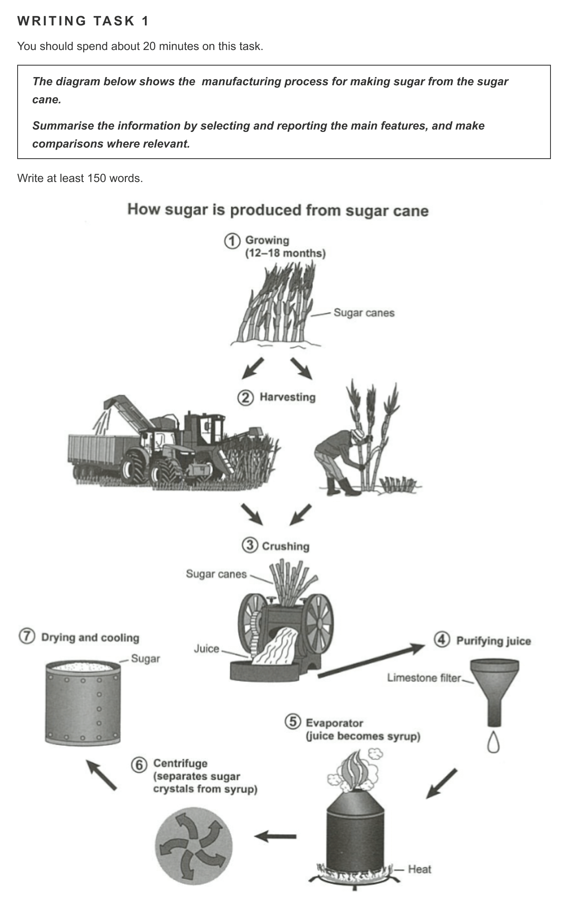
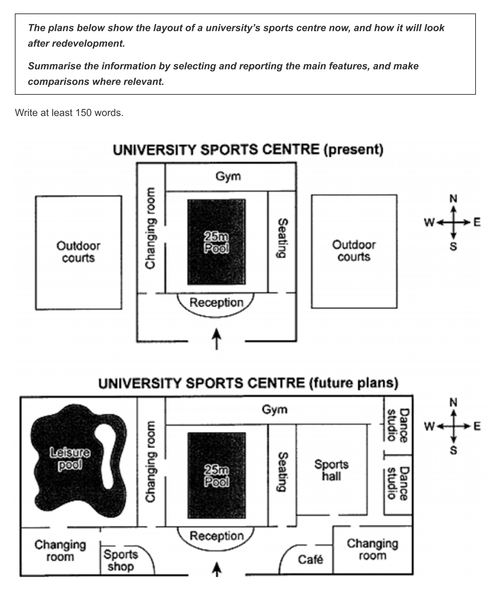
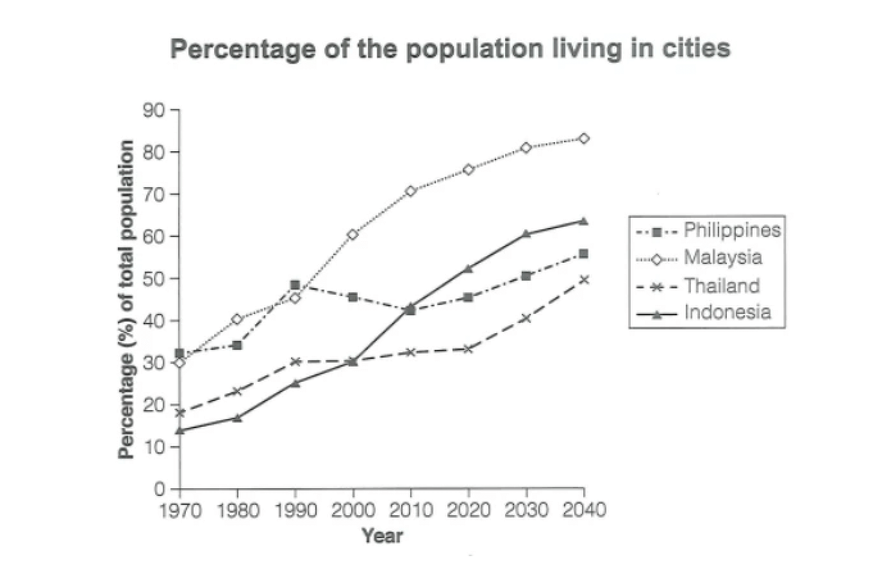
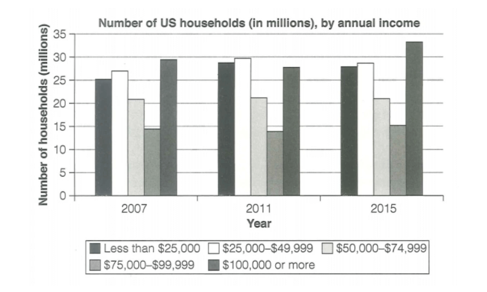
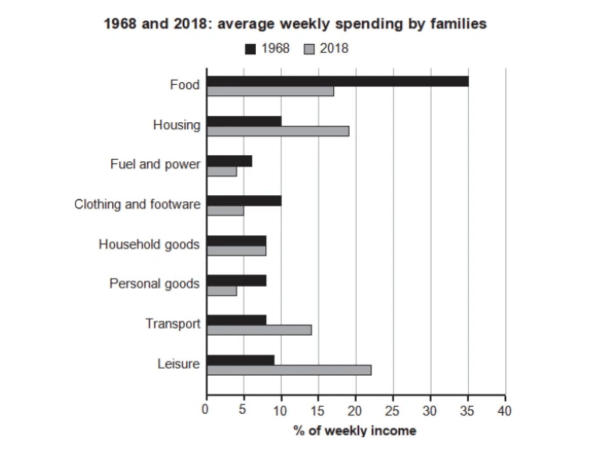

# 雅思写作 - IELTS Writing

## Task 1 小作文

### 流程图 工业生产类

rinse 用清水冲洗

wash 用清洁剂清洗

dry 烘干

fry 油炸

#### 范文1 制糖流程图

The flow chart illustrates the procedures of obtaining sugar from growing sugar cane.

It is clear that the elaborate manufacturing process of sugar involves seven different stages and specialized machinery. The process begins with sugarcane cultivation and the final product is dry sugar crystals that can be used for consumption.

To begin with, sugarcane is grown and cared for over a period of 12-18 months. Afterwards, sugarcane is harvested either by hand or by using specialized machines. Sugarcane is then crushed in the third stage to extract juice, the raw material for sugar production.

The fourth stage involves purifying sugar cane juice with limestone filters. This process eliminates all impurities and debris from the juice, producing pure sugarcane juice. After that, the fifth stage is heating the juice to evaporate the water, which helps to obtain the thick syrup.

Next, in the sixth stage, sugar crystals are separated from the syrup by using a centrifuge. The separation eliminates any remaining impurities in the syrup, and sugar crystals are obtained. Finally, sugar crystals are dried, cooled, and packed into bags ready for sale.

翻译：

这张流程图说明了从种植甘蔗到获得糖的步骤。

很明显，糖的精细制造过程包括七个不同的阶段和专门的机器。这个过程从甘蔗种植开始，最终产品是可用于消费的干糖晶体。

首先，甘蔗的种植和照料时间为 12-18 个月。之后，会手动或使用专门的机器收割甘蔗。然后，在第三阶段压榨甘蔗以提取汁液，这就是制糖的原料。

第四阶段会用石灰石过滤器净化甘蔗汁。这个过程消除了果汁中的所有杂质和碎屑，生产出纯甘蔗汁。之后的第五阶段是加热果汁蒸发水分，这有助于获得浓稠的糖浆。

接下来，在第六阶段中，使用离心机将糖晶体从糖浆中分离出来。在分离过程中，糖浆中残留的杂质会被清除，从而得到糖晶体。最后，糖晶体被烘干、冷却并包装成袋，准备出售。

---

#### 范文2 历史选址图

The provided maps illustrate the current and future layout of a university's sports center.

Overall, the sports center will be extended westward and eastward after the redevelopment. It will also experience an expansion with more facilities for the purpose of providing diverse opportunities for students and faculty to engage in various sports activities and recreation.

The current plan shows a pool at the facility's center, with a changing room, a gym, seating areas, and a reception surrounding it. Meanwhile, two outdoor courts occupy the western and eastern parts of the sports center. 

In contrast, the future design of the sports center sees several significant changes. The entire area will expand to accommodate new functional spaces while existing features such as the pool, the changing room, seating areas, and entrance will remain in their original locations. The gym will significantly extend to cater to a more extensive faculty, while two outdoor courts will give way to a leisure pool and a sports hall. Moreover, there will be new additions in the open area, such as two changing rooms, a shop, a café, and dance studios.

翻译：

给出的地图说明了大学体育中心的当前和未来布局。

总的来说，体育中心将在重建后向西和向东延伸。它还将进行扩建，增加更多的设施，为学生和教师提供各种体育活动和娱乐活动的机会。

目前的规划显示设施中心有一个游泳池，环着游泳池有更衣室、健身房、休息区和接待处。同时，两个室外球场占据了运动中心的西部和东部。

相比之下，运动中心未来的设计有几个显著的变化。整个区域将扩大以容纳新的功能性空间，而游泳池、更衣室、休息区和入口等现有设施将保留在原来的位置。体育馆将显着扩展，以满足更广泛的教职员工的需求，而两个室外球场将让位给一个休闲游泳池和一个体育馆。此外，开放区域将新增两间更衣室、一间商店、一间咖啡厅和舞蹈室。

---

参考分段思路：

步骤①-⑥大致对应重新开始生产塑料用品前的“准备工作”，步骤⑦-⑨对应生产塑料用品的过程。因此可以步骤①-⑥一段，步骤⑦-⑨一段。
P.S. 这道题的分段方法并不唯一，如果你有其他思路，只要言之有理即可~

参考开头段 + 概述段：

The flow chart illustrates how plastic bottles are recycled.

Overall, it is clear that the process has nine steps, starting from collecting used plastic to manufacturing recycled products.

参考语料：

词汇：

cyclical (adj.) 周期的，循环的

reuse (v./n.) 重复使用

reusable (adj.) 可重复使用的

recycling plant 回收处理厂

crusher (n.) 压碎机

pour (v.) 倒（液体等）

melt (v.) （使）融化，熔化

pack (v.) （把······）打包

production line 生产线

manufacture (v.) （用机器）大量生产，成批制造

subsequently (adv.) 随后，接着

consist of 由······组成

sort by hand 手工分类

dispose of 处理

break down 分解

句式：

The flow chart illustrates ... 这个流程图说明了······
说明步骤总数及起止点：

The diagram shows that there are ... main stages in ...
The process has ... steps, starting from (doing) sth. to (doing) sth.
描述步骤开始：

The process begins with ...
The first step is marked by ...
描述中间步骤：

the second/third/fourth step is ... 第2/3/4个步骤是······
next/ then 接下来，然后
after that, ... (+句子) 
When ... have/has been done, + 句子  当······完成之后，······
描述步骤结束：

The process ends with ...
The final step is marked by ...
Finally, ...
描述步骤不同点：

It is clear that the ... stages ... while the rest ...

---

### 折线图

> The graph below gives information about the percentage of the population in four Asian countries living in cities from 1970 to 2020, with predictions for 2030 and 2040.
> 
> Summarise the information by selecting and reporting the main features, and make comparisons where relevant.

#### 优秀范文1

**6.5分 166词**

The line graph shows urbanization rates in four Asian countries — the Philippines, Malaysia, Thailand, and Indonesia — over seven decades, from 1970 to 2040.

这张折线图展示了菲律宾、马来西亚、泰国和印度尼西亚这四个亚洲国家在1970年至2040年这70年间的城市化率。

During this period, Malaysia and Indonesia experienced and are projected to have significant urbanization growth, while the other two countries showed and will have more gradual increases.

在这段时间内，马来西亚和印度尼西亚的城市化率出现显著增长，而其他两个国家的增长较为缓慢。

According to the chart, Malaysia's urbanization surged from 30% in 1970 to 75% in 2020, and the projection indicates that it will further increase to 82% by 2040. Indonesia also showed an upward trend, though slower. Its urban population increased by nearly 35% over the five decades, reaching 50% in 2020 and being expected to reach approximately 62% in 2040.

根据图表，马来西亚的城市化率从1970年的30%上升至2020年的75%，预测将进一步增长至2040年的82%。印度尼西亚也呈现出上升趋势，尽管速度较慢。在过去的50年中，印度尼西亚的城市人口增长了近35%，在2020年达到50%，预计将在2040年达到约62%。

Thailand's urbanization had a 10% rise from 1970 to 1990 and remained stable for the next 30 years. However, it is predicted to have a late increase, with its urbanization rate pushed to around 50% by 2040. The Philippines' urbanization had some complexities, with a slight decline from 1990 to 2010, but overall it followed an increasing pattern.

泰国的城市化率在1970年至1990年间上升了10%，在接下来的30年内保持稳定。然而，预测显示其将在2040年有一次后期增长，将城市化率推至约50%。菲律宾的城市化过程较为复杂，从1990年到2010年有轻微下降，但总体上呈现增长趋势。

#### 优秀范文2

**7分 202词**

The line chart shows the percentages of urban population in four Asian countries — the Philippines, Malaysia, Thailand, and Indonesia — from 1970 to 2020, with projections extended to 2040.

这张折线图展示了四个亚洲国家（菲律宾、马来西亚、泰国和印度尼西亚）从1970年到2020年的城市人口比例，并将预测数据延伸至2040年。

Before 1990, all four countries experienced an upward trend in urbanization, with the Philippines leading. After 1990, their urbanization rates showed both increases and decreases.

在1990年之前，这四个国家的城市化率呈上升趋势，其中菲律宾位居前列。而在1990年之后，它们的城市化率出现了增加和减少的趋势。

In 1970, the Philippines had the highest percentage of urban population at around 31%, followed closely by Malaysia at 30%. Thailand and Indonesia had lower percentages, approximately 19% and 14%, respectively. Over the next two decades until 1990, all four countries' urbanization rates continued to rise, with the Philippines still leading.

在1970年，菲律宾的城市人口比例最高，约为31%，紧随其后的是马来西亚，约为30%。而泰国和印度尼西亚的城市化率较低，分别约为19%和14%。在接下来的二十年，直至1990年，这四个国家的城市化率继续上升，其中菲律宾依然处于领先地位。

However, from 1990 to 2020, the Philippines saw a slight decline in urbanization, reaching about 45% in 2000 and nearly 42% in 2010. In contrast, Malaysia and Indonesia experienced significant urbanization growth after 1990. Thailand had a less pronounced change but steadily increased its urbanization during this period.

然而，从1990年到2020年，菲律宾的城市化率略有下降，2000年约为45%，2010年接近42%。相比之下，马来西亚和印度尼西亚在1990年之后都经历了显著的城市化增长。泰国的变化较为缓慢，但在这段时期城市化率仍在稳步增加。

Based on the projected data, it is expected that by the year 2040, the proportions of the urban population in all four countries will continue to experience rapid growth, among which Malaysia is expected to maintain its dominant position in urbanization, with over 80% of its population living in cities.

根据预测数据，预计到2040年，所有四个国家的城市人口比例将持续快速增长，其中马来西亚预计将继续在城市化方面保持主导地位，城市人口比例将超过80%。

### 条形图

> The chart below shows the number of households in the US by their annual income in 2007, 2011 and 2015.
>
> Summarise the information by selecting and reporting the main features, and make comparisons where relevant.

#### 优秀范文1

6分，264词

The bar chart illustrates the number of American households sorted by their income in each of the three years, 2007, 2011, and 2015. It is noticeable that the numbers of the highest-income families and lower-income households were constantly higher than the figures for the medium-level group in the three given years. Moreover, the former income groups saw an overall rise in numbers from 2007 to 2015 while the latter remained stable during the same period.

柱状图显示了2007年、2011年和2015年按年收入金额排列的美国家庭数量。值得注意的是，在这三年中，最高收入家庭和低收入家庭的数量一直高于中等收入家庭的数量。此外，从2007年到2015年，前者的家庭数量总体呈上升趋势，而后者在同一时期保持稳定。

In 2007, the largest number of households had an annual income of $100,000 or more, totaling about 30 million. Following closely was the number of households earning between $25,000 and $49,999, with a quantity ranging from 25 million to 30 million. A slightly smaller number of households, around 25 million, had an income below $25,000. Around 20 million households fell into the category of earning between $50,000 and $74,999. Lastly, households with incomes ranging from $75,000 to $99,999 numbered approximately 15 million.

在2007年，拥有年收入10万美元或以上的家庭数量最多，约为3000万户。紧随其后的是年收入在25000美元至49999美元之间的家庭，数量在2500万至3000万之间。年收入低于25000美元的家庭数量稍低，约2500万户。约有2000万户家庭的收入处于50000美元至74999美元之间。最后，年收入在75000美元至99999美元之间的家庭大约有1500万户。

But in 2011, things changed. The $25,000-$49,999 group became the biggest with around 30 million households. The households earning $100,000 or more went down to about 27 million. This was even less than those earning below $25,000. The $75,000-$99,999 group was still the smallest and had fewer households than in 2007.

但在2011年，情况发生了变化。25000美元至49999美元的群体数量变为最多，有约3000万户家庭。收入10万美元或以上的家庭减少到约2700万。这甚至低于那些收入低于25000美元的家庭。与2007年相比，75000至99999美元的家庭占比最小，家庭数量更少了。

By the year 2015, the category of $100,000 or more regained its position as the largest group, with the count approximating 33 million households. Both the categories of less than $25,000 and $25,000-$49,999 witnessed a marginal decrease compared with those in 2011. The $75,000-$99,999 bracket consistently remained the smallest group, barely reaching the 15 million mark.

到 2015 年，10万美元或以上的家庭重新成为人口最多的群体，数量约为3300万户。与 2011 年相比，25000美元以下和25000美元至49999美元这两个类别的人数都略有减少。75000至99999美元组别始终是数量最少的组别，勉强达到1500万。

> 这篇范文用了大量的数字和数量词来表达具体的数据，让读者更清晰地理解各个收入群体的人数和比例。总体结构比较清晰，但缺乏连贯性。
>
> 此外，范文还使用了一些表示顺序、对比和转折的过渡词，如“following closely (紧跟着)”、“slightly smaller (略小于)”、“lastly (最后)”和“marginally decrease (略有减少)”，使文章更连贯、易懂。但本文的词汇多样性和准确性仍有提升的空间，语法结构也是简单句偏多，缺乏一些高级句式的运用。

#### 优秀范文2

6.5分，271词

The bar chart delineates the variation in the number of American households categorized by their annual income in three different years. It is worth noting that in the two groups with annual incomes ranging from $50,000 to $99,999, the number of households remains relatively unchanged. Despite this, the quantity in each of the remaining income groups demonstrated an ascending trend with significant variability.

柱状图描述了按年收入分类的美国家庭数量在三个不同年份的变化情况。值得注意的是，在年收入为50000至99999美元的两组中，家庭数量基本保持不变。尽管如此，其余各收入组别的家庭数量均呈上升趋势，且变化很大。

In 2007, the largest number of households belonged to the category with an annual income of $100,000 or more, totaling around 30 million. This was followed by the group with incomes ranging from $25,000 to $49,999 with a number between 25 to 30 million. The category of households earning less than $25,000 annually had a slightly lower number, around 25 million. Subsequently, there were about 20 million households with incomes between $50,000 and $74,999. Lastly, households with incomes between $75,000 and $99,999 accounted for approximately 15 million households.

2007 年，年收入在10万美元或以上的家庭数量最多，约有3000万户。紧随其后的是年收入在25000美元至49999美元之间的家庭，数量在2500万至3000万之间。其次是年收入在25000美元以下的家庭，数量略低，占2500万左右。年收入在50000美元至74999美元之间的家庭数量也有2000万户。最后是年收入在75000美元至99999美元之间的家庭，约有1500 万户。

In 2011, this situation underwent some changes. The bracket of $25,000-$49,999 emerged as the largest group, encompassing around 30 million households. Intriguingly, the category of $100,000 or more witnessed a decline to around 27 million, even lower than the less than $25,000 group. The $75,000-$99,999 bracket persistently remained the smallest group, with the number of households even experiencing a decrease compared with that in 2007.

到2011年，这种情况有了一些改变。25000美元至49999美元的收入区间成为人口最多的组别，约有3000 万户家庭。有趣的是，10万美元或以上的家庭减少到约2700万户，甚至低于25000美元以下的家庭。75000至99999美元组别始终是人口最少的群体，家庭数量甚至比2007年有所减少。

By the year 2015, the category of $100,000 or more regained its position as the largest group, with the count approximating 33 million households. Both the categories of less than $25,000 and $25,000-$49,999 witnessed a marginal decrease compared with those in 2011. The $75,000-$99,999 bracket consistently remained the smallest group, barely reaching the 15 million mark.

到2015年，10万美元或以上的家庭重新成为人口最多的群体，数量约为3300万户。与 2011 年相比，25000美元以下和25000美元至49999美元这两个类别的人数都略有减少。75000至99999美元组别始终是人口最少的组别，勉强达到1500万。

> 这篇范文运用了更多的衔接词和短语，如“intriguingly (有趣的是)”和“by the year (某年之前)”等，使得整篇文章更有连贯性。
>
> 6.5分的范文词汇丰富且准确，如“underwent (经历)”和“persistently (始终)”；一些句子结构也很亮眼，例如，在第二个主体段中，作者使用了动词“emerged (出现)”和现在分词“encompassing (包括)”来描述25000至49999美元收入群体的变化和规模，以展示其高水平的词汇和语法能力。这种表达方式清晰地传达了相关信息。

### 条形图

> The chart below gives information about how families in one country spent their weekly income in 1968 and in 2018.
>
> Summarise the information by selecting and reporting the main features and make comparisons where relevant.

#### 我的作文

The bar graph illustrates the average weekly expenditure by families in a specific region in 1968 and 2018, across various categories including food, housing, fuel and power, clothing and footwear, household goods, transport, and leisure activities.

In summary, there was a noticeable decline in spending on food, fuel and power, clothing and footwear, as well as personal goods, whereas costs for housing, transport, and leisure activities rose significantly. Expenditure on household goods remained relatively stable.

In 1968, the largest share of family spending was on food, accounting for 35%, while the smallest portion was allocated to fuel and power, at just over 5%.

By 2018, the highest proportion of spending had shifted to leisure activities, at just over 20%, while the lowest proportions were for personal goods and fuel and power, both nearing 5%.

Comparing the proportions of all costs in 1968 and 2018, it is evident that family expenditures became more evenly distributed across the different categories.

#### 优秀范文1

6分，180词

The bar chart shows the percentage of weekly household spending on various items in a country in 1968 and in 2018. In 1968, families spent most of their money on food. But in 2018, leisure was what families cared about the most. A significant point is that the money on household goods stayed the same in both years.

这个柱状图展示了1968年和2018年，某个国家的家庭每周在各个方面的花费占比。1968年，家庭的大部分钱都花在了食物上。但到了2018年，他们在休闲活动上的花费最多。值得注意的是，两年中用于家庭物品的花费都保持不变。

In 1968, nearly 35% of the money went to food. But 50 years later, this dropped to 17%. In the same period, there was less money spent on fuel and power (it went down from 7% to 4%), clothing and footwear (from 10% to 5%), and personal goods (from 8% to 4%). In both years, families spent around 8% of their money on household goods.

1968年，大约有35%的钱花在了食物上。但50年后，这一比例下降到了17%。在同一时期，花在燃料和能源上的钱减少了（从7%下降到4%），在衣服和鞋子上的花费也减少了（从10%下降到5%），个人物品的花费也减少了（从8%下降到4%）。在这两年里，家庭都花了8%的钱在家里的物品上。

By 2018, leisure was what families cared about the most. They spent about 22% of their money on it, which was a big jump from 9% in 1968. In these 50 years, families also spent more on homes and moving around or transport – they almost spent 9% more on homes and 6% more on transport.

到2018年，休闲活动成为家庭开支最多的方面。他们在这方面花了22%左右的钱，这比1968年的9%有了大幅增加。在这50年里，家庭在住房和交通上的花费也增加了——他们大约在住房上多花了9%，在交通上多花了6%。

#### 优秀范文2

6.5分，170词

The bar chart shows the percentage of weekly household spending on various items in a country in 1968 and in 2018. In 1968, families spent most of their money on food. But in 2018, leisure was what families cared about the most. A significant point is that the money spent on household goods stayed the same in both years.

这个柱状图展示了1968年和2018年，某个国家的家庭每周在各个方面的花费占比。1968年，家庭的大部分钱都花在了食物上。但到了2018年，他们在休闲活动上的花费最多。值得注意的是，两年中用于家庭物品的花费都保持不变。

In 1968, the largest proportion of household expenses was food, which accounted for about 35%. Families spent roughly the same amount, around 10%, on housing and clothing and footwear. All the other categories, including household goods, personal goods, transport, and leisure, hovered around 7—8%. The least spending was on fuel and power, which was nearly 6%.

在1968年，占家庭开销比例最大部分的是食物，大约占了35%。在住房以及服装和鞋类上的支出大致相同，均为10%左右。其他所有类别，包括家用商品、个人用品、交通和休闲，都在7～8%左右。支出最少的是燃料和能源，约为6%。

By 2018, there were noticeable changes in the spending. Leisure took the lead with about 22% of the total expenditure. The money on leisure in 2018 was more than double that in 1968. However, most categories saw a drop in 2018 compared with those in 1968, with the exceptions being housing, transport, and leisure.

到了2018年，支出模式出现了明显的变化。休闲成为了主要的支出，大约占总支出的22%。2018年在休闲上的花费是1968年的两倍多。然而，与1968年相比，2018年的大多数类别都有所下降，只有住房、交通和休闲三个类别例外。