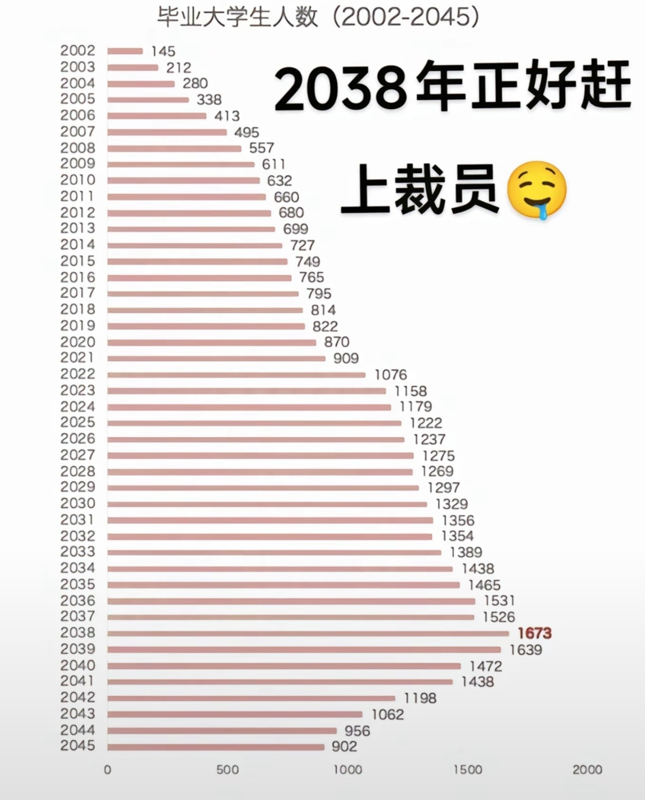
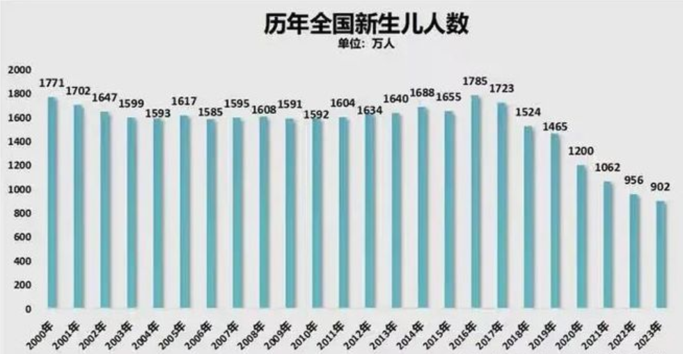

# 基于应届毕业生人数的相关预测

> 相关数据来自网络搜索，不构成任何统计依据。请自行甄别数据可靠性。

## 1 背景

据教育部预测，2025年大学毕业生人数将达到1222万人，再创历史新高。这一趋势预计还将在未来10年内持续，导致就业市场竞争日益激烈。

各年份应届毕业生预估人数：

各年份出生人口: 

## 2 可能的商业机会

在这种情况下，以下商业机会可能值得考虑：

### 2.1 ⭐职业培训与技能提升服务

随着就业市场竞争加剧，毕业生对职业技能培训的需求将增加。提供针对性的职业培训、实习机会、职业规划咨询等服务，可以帮助毕业生提升就业竞争力。

### 2.2 就业服务平台

开发专门针对大学毕业生的就业服务平台，提供职位信息、求职指导、面试技巧等，帮助他们更有效地找到合适的工作。

### 2.3 ⭐灵活就业平台

随着就业形态的多样化，灵活就业（如自由职业、兼职等）成为趋势。建立相关平台，连接用人单位和求职者，满足多样化的就业需求。

### 2.4 创新创业孵化器

鼓励和支持有创业意向的毕业生，提供创业培训、资金支持、导师指导等服务，帮助他们实现创业梦想。

### 2.5 ⭐心理咨询与支持服务

面对就业压力，许多毕业生可能出现焦虑等心理问题。提供专业的心理咨询和支持服务，可以帮助他们应对压力，保持积极心态。

**观点**：建议是嵌套在其他服务内作为产品特点，而不是单独的产品。在经济下行周期内，人们为心理咨询付费的意愿可能不高。

### 2.6 教育与职业匹配服务

提供教育背景与职业需求匹配的咨询服务，帮助毕业生选择适合的职业路径，减少就业与专业不匹配的问题。

### 2.7 海外就业与留学咨询

随着国内就业压力增大，部分毕业生可能考虑海外就业或继续深造。提供相关咨询和服务，满足这一需求。

---

总之，随着大学毕业生人数的持续增长，围绕他们的就业、培训、心理支持等方面的服务需求将显著增加。抓住这些需求，提供相应的产品和服务，将更有望在未来的市场中获得成功。

一方面，这不仅是可预见的能够有增量的市场；另一方面，这也是一个潜在的商业机会。

## 3 参考

<a href="https://xueqiu.com/2524803655/297810998" target="_blank">1. 人口数据--雪球投资</a>

<a href="https://www.stats.gov.cn/sj/ndsj/2024/indexch.htm" target="_blank">2. 2024统计年鉴--统计局</a>

